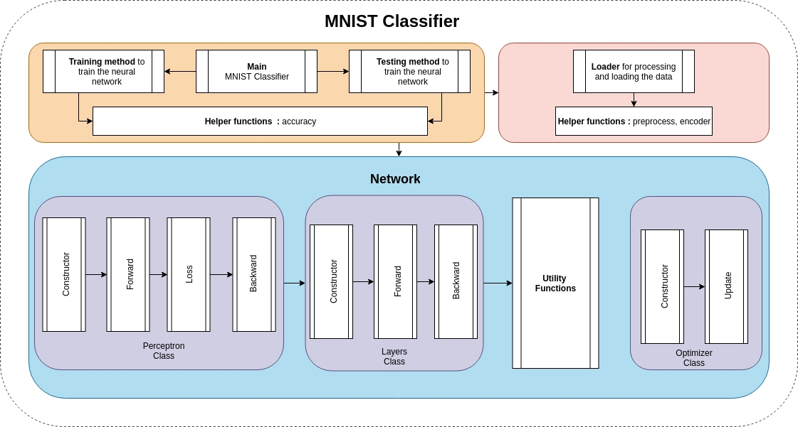
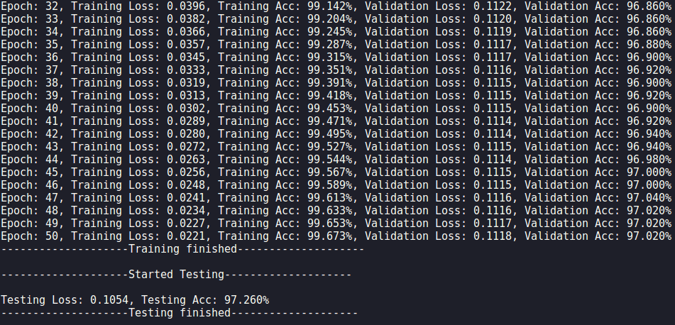
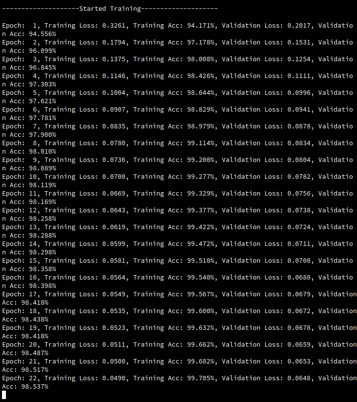
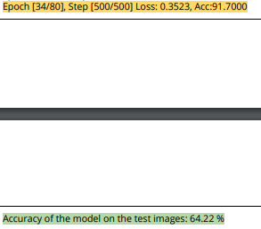
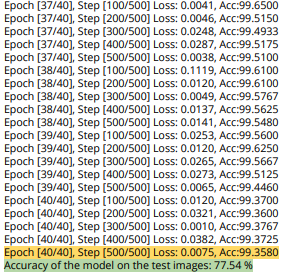

# Deep Learning : CS 598 - UIUC
### About this repository

### Machine Problems:

#### MP1 : MNIST Classification using perceptron (from scratch)

**Objective** : Implement and train a neural network from scratch in Python for the MNIST dataset (no PyTorch). The neural network should be trained on the Training Set using stochastic gradient descent. It should achieve 97-98% accuracy on the Test Set. For full credit, submit via Compass (1) the code and (2) a paragraph (in a PDF document) which states the Test Accuracy and briefly describes the implementation.

**Implementation** :  The model I have designed is inspired from Tensorflows Layes API (specifically, fullyconnected API, Optimizer API and activationtion functions). I have written the code which is generalized for any number of hidden layers and activation function. The following is the overall layout of the model :

 

The entire pipeline is defined in the three layer of abstraction : MNIST_Classifier.py 
​(main), data_tools.py (helper module for main) and Network. Main handles the high 
​level pipeline of the loading data, training and testing the model. Network is the module consisting of 3 classes and utility functions. Classes are : Perceptron (class to build network), Layers (Class to build one layer i.e. Hidden layers) and StochasticGradientDescent (Class to update weights and biases through optimizer). Utility functions are loss functions, derivative of loss functions, activation functions and their derivatives.

*Network 1:* 
Double Hidden Layers : 128 units, 32 units 
Activations : Relu, Relu  

Network 2: 
Single Hidden Layer : 128 units 
Activation : Relu 

#### MP2 : MNIST Classification with CNN (from scratch)

**Objective** : Implement and train a convolution neural network from scratch in Python for the MNIST dataset (no PyTorch). You should write your own code for convolutions (e.g., do not use SciPy's convolution function). The convolution network should have a single hidden layer with multiple channels. It should achieve at least 94% accuracy on the Test Set. For full credit, submit via Compass (1) the code and (2) a paragraph (in a PDF document) which states the Test Accuracy and briefly describes the implementation.

**Implementation** : In this model I have tried making my model architecture similar to the previous MP (MP1). The only changes to the below pipeline is that instead of perceptron class, I have used CNN class. There are minor changes in the flow diagram but not worth accounting in high level. In this implementation I have attempted fancy indexing implementation (Receptive field implementation) that was discussed in UIUC CS446 as well as in Stanfords CS 231n to make convolutions faster. Instead of implementing three for loops : for channel, for height of image, for width of the image; the alternative is O(n) instead of O(n^3). The utility functions are provided by the course assignments. Hence, I have commented the flow (steps) of the implementation. I have used a blog to understand the implementation as well.  

Results of the implementation:

#### MP3 : CIFAR10 Classification (PyTorch)

**Objective** : Train a deep convolution network on a GPU with PyTorch for the CIFAR10 dataset. The convolution network should use (A) dropout, (B) trained with RMSprop or ADAM, and (C) data  augmentation. For 10% extra credit, compare dropout test accuracy (i) using the heuristic prediction rule and (ii) Monte Carlo simulation. For full credit, the model should achieve 80-90% Test Accuracy. Submit via Compass (1) the code and (2) a paragraph (in a PDF document) which reports the results and briefly describes the model architecture.

The loss & accuracy curve for this implementation is given below:

> **BONUS PART**
>
> 

#### MP4 : CIFAR100 ResNet and ImageNet Transfer learning (PyTorch)

**Objective** : Implement a deep residual neural network for CIFAR100. [**Homework #4 Details.** ](https://courses.engr.illinois.edu/ie534/fa2018/secure/IE534_HW4.pdf)

**Implementation** : Please refer to the above given guidelines of implementation (Homework #4 Details).

*Part 1 Results* :

*Part 2 Results* :

